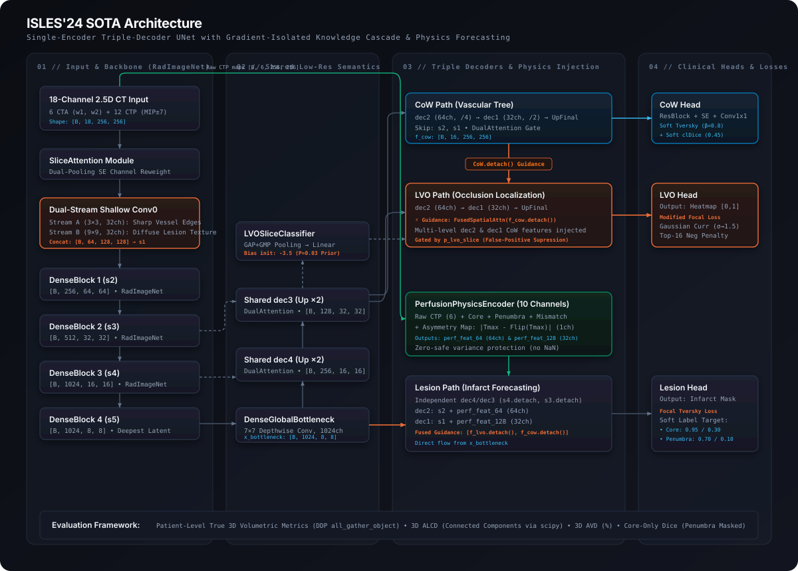

# ISLES'24: Multi-Task Stroke Segmentation & Spatio-Temporal Perfusion Forecasting

[](https://www.python.org/downloads/)
[](https://pytorch.org/)
[](https://pytorch.org/tutorials/intermediate/ddp_tutorial.html)
[](https://www.isles-challenge.org/)
[](#-model-architecture)
[](LICENSE)

An end-to-end deep learning pipeline for **Acute Ischemic Stroke (AIS)** multi-task assessment on multi-modal brain CT scans (NCCT, CTA, and CTP maps: CBF, CBV, MTT, Tmax).

This repository contains the full production-ready implementation of the **Single-Encoder Triple-Decoder UNet**, featuring a **Gradient-Isolated Knowledge Cascade**, **10-Channel Perfusion Physics Forecasting**, **Continuous Soft-Labeling**, and **Patient-Level 3D Volumetric Evaluation**.

---

## 🏛️ Model Architecture

The architecture models the pathophysiological relationship between brain vasculature and ischemic tissue necrosis using a **Single-Encoder Triple-Decoder** with RadImageNet medical pretraining:



> 💡 **Interactive Diagram:** Open [`docs/architecture.html`](docs/architecture.html) in your browser for the full-resolution vector layout and detailed technical annotations.

---

## 🔬 Core Algorithmic Innovations

### 1. Gradient-Isolated Knowledge Cascade (`CoW.detach() → LVO`)
* **Clinical Prior:** Large Vessel Occlusions (LVO) can only physically occur within the arterial vasculature (Circle of Willis - CoW).
* **Algorithmic Solution:** High-level features from the CoW decoder act as a spatial spotlight (`FusedSpatialAttention`) to narrow down the search space for LVO.
* **Gradient Isolation:** Crucially, CoW features are detached (`.detach()`) before entering the LVO path. This one-way information flow ensures that large penalty gradients from LVO false-positive suppression **never backpropagate into or distort the vascular tree features**.

### 2. Perfusion Physics Encoder (10-Channel Clinical Prior)
* Rather than treating lesion prediction as static 2D image segmentation, the model acts as a **Spatio-Temporal Forecaster** of ischemic penumbra progression.
* The `PerfusionPhysicsEncoder` receives a 10-channel tensor comprising:
  1. **6-Channel Raw CTP Maps:** `[CTA_w1, CTA_w2, Tmax, CBF, CBV, MTT]`
  2. **Hemispheric Asymmetry:** $\Delta \text{Tmax} = |\text{Tmax} - \text{Flip}(\text{Tmax})|$ to capture cross-hemispheric perfusion mismatch.
  3. **Clinical Prior Zones (DEFUSE-3 / DAWN criteria):**
     - **Infarct Core Map:** $(\text{Tmax} > 6\text{s}) \land (\text{CBF} < 30\%)$
     - **Penumbra Map:** $(\text{Tmax} > 4\text{s}) \land \neg(\text{Tmax} > 6\text{s})$
     - **Mismatch Vector:** $\text{Core} - \text{Penumbra}$
* Injected directly into the Lesion decoder skip pathways without altering the primary 18-channel input, **preserving 100% of RadImageNet pre-trained weights**.

### 3. Dual-Stream Shallow Convolution (`conv0_A` & `conv0_B`)
* The standard 7×7 `conv0` of DenseNet-121 is decoupled into two parallel streams:
  * **Stream A (3×3, 32ch):** Sharp receptive field optimized for thin vascular structures (CoW, LVO).
  * **Stream B (9×9, 32ch):** Large receptive field designed to aggregate diffuse textures and smooth density gradients across brain parenchyma (Lesion).
  * Feature maps are concatenated to form `s1` (`[B, 64, 128, 128]`).

### 4. Continuous Soft Lesion Labeling
* To address the clinical ambiguity of tissue viability in the penumbra, binary ground-truth masks are softened based on physiological status:
  * **Infarct Core:** $0.95$ (Positive GT) / $0.30$ (Negative GT - tolerance for co-registration errors).
  * **Ischemic Penumbra:** $0.70$ (Positive GT) / $0.10$ (Negative GT - tissue salvageable by reperfusion therapy).
  * **Benign Tissue:** $0.90$ (Positive GT) / $0.00$ (Negative GT).
* Fully optimized via **Batch-Level Focal Tversky Loss** ($\alpha=0.4, \beta=0.6, \gamma=2.0$).

### 5. LVO Gaussian Heatmap Curriculum & Top-16 Negative Penalty
* LVO keypoint targets are generated on-the-fly via Gaussian smoothing with a dynamic curriculum:
  $$\sigma(\text{epoch}) = \max(\sigma_{\text{floor}}, \sigma_{\text{init}} \cdot \text{decay}^{\text{epoch}})$$
* **Negative Slice Suppression:** Negative slices (no LVO present) are penalized using the mean of the **Top-16 predicted probabilities**, eliminating fuzzy low-confidence false-positive clouds.

---

## 📊 Evaluation & Metrics (Patient-Level 3D)

Validation metrics compute true clinical 3D volumetric scores rather than slice-level approximations:

| Metric | Target | Formula / Description |
| :--- | :---: | :--- |
| **3D ALCD** | $\downarrow$ | **Absolute Lesion Count Difference:** 3D connected components counted via `scipy.ndimage.label(..., structure=np.ones((3,3,3)))`. |
| **3D AVD** | $\downarrow$ | **Average Volumetric Difference (%):** $\frac{\lvert V_{\text{pred}} - V_{\text{gt}} \rvert}{\max(V_{\text{gt}}, 1)} \times 100$, capped at 500%. |
| **Core-Only Dice** | $\uparrow$ | **Infarct Core Dice:** Evaluated exclusively on Core and Benign zones while **completely masking out ambiguous Penumbra pixels**. |
| **LVO F1** | $\uparrow$ | Instance-level Distance-to-Centroid (D2C) matching (threshold radius 14.5px). |
| **CoW Dice** | $\uparrow$ | Overlap score of Circle of Willis vascular topology. |

> [!TIP]
> **Zero-VRAM 3D Evaluation:** During validation across multiple GPUs (DDP), 2D boolean masks are gathered into system host RAM via `dist.all_gather_object`. Reconstruction and 3D labeling run entirely on the CPU, guaranteeing **0% GPU VRAM overhead** and zero out-of-memory risks.

---

## 📦 Data Pipeline & Preprocessing

The dataset is engineered into an **18-channel 2.5D hybrid representation** stored as `.npy` files:

$$\text{Input Tensor (18, 256, 256)} = \begin{cases} 
\text{Channels 00--05:} & \text{MIP Below } [Z-7 \dots Z-1] \\ 
\text{Channels 06--11:} & \text{Center Slice } [Z] \\ 
\text{Channels 12--17:} & \text{MIP Above } [Z+1 \dots Z+7] 
\end{cases}$$

### Preprocessing Protocol:
1. **Affine Synchronization:** Re-aligns CTA, CTP, and annotations onto the spatial matrix of NCCT (`sform_code=1`) to eliminate physical coordinate discrepancies.
2. **Conservative Skull-Stripping:** Brain extraction via HD-BET followed by a 3-pixel morphological dilation to preserve cortical boundary vessels.
3. **Clinical Windowing & Min-Max Normalization:**
   * CTA Window 1 (Soft Tissue): `[0, 90] HU` $\rightarrow [0, 1]$
   * CTA Window 2 (Vessels): `[60, 400] HU` $\rightarrow [0, 1]$
   * Perfusion Maps: Tmax `[0, 7]s`, CBF `[0, 35]`, CBV `[0, 10]`, MTT `[0, 20]s`
4. **Ghost Purging:** Slices outside cranial parenchyma are purged permanently.
5. **Stratified Patient-Level Split:** Data splitting is strictly performed on patient IDs (GroupKFold) to prevent cross-slice data leakage.

---

## 🚀 Training & Distributed Systems

* **Multi-GPU DistributedDataParallel (DDP):** Powered by the high-throughput **NCCL** backend.
* **Automatic Mixed Precision (AMP):** FP16 execution using `torch.amp.autocast('cuda')` and `torch.amp.GradScaler`.
* **VRAM Defragmentation:** Employs `PYTORCH_ALLOC_CONF="expandable_segments:True"` for stability during long multi-epoch runs.
* **3-Phase LR Scheduler:** Warmup (5 epochs) $\rightarrow$ Hold (7 epochs) $\rightarrow$ Cosine Annealing (88 epochs).
* **Differential Learning Rates:**
  * Encoder Pretrained: `5.0e-06`
  * Custom Encoder Input Layers (`conv0_A`, `conv0_B`, `SliceAttention`): `5.0e-04`
  * Decoder & Task Heads: `5.0e-04`

---

## 📁 Repository Structure

```text
isles24-Stroke-multi-task-seg/
├── docs/
│   ├── architecture.svg          # Standalone high-res vector diagram
│   └── architecture.html         # Interactive editorial architecture viewer
├── src/
│   ├── configs/
│   │   ├── data.yaml             # Dataloader, split, and augmentation configs
│   │   ├── model.yaml            # Network channels, attention, and dropout configs
│   │   └── train.yaml            # Losses, optimizer, scheduler, and PGW configs
│   ├── models/
│   │   ├── encoder.py            # DenseNet-121 with RadImageNet & Dual-Stream conv0
│   │   ├── decoder.py            # Shared Decoder, TaskPath, AttentionGates
│   │   ├── heads.py              # MultiTaskHeads with SE and custom bias inits
│   │   └── single_unet.py        # SingleEncoderUNet & PerfusionPhysicsEncoder
│   ├── data/
│   │   ├── dataset.py            # ISLES24Dataset & Gaussian heatmap generator
│   │   ├── dataloader.py         # Distributed DataLoader & CTP-safe Copy-Paste
│   │   ├── fold_split.py         # Stratified Patient-level K-Fold & Smart Sampling
│   │   └── transforms.py         # Albumentations-based data augmentation
│   ├── compile/
│   │   ├── losses.py             # Focal Tversky, Modified Focal, clDice, Soft Labeling
│   │   ├── metrics.py            # 3D ALCD, 3D AVD, Core-Only Dice, D2C LVO F1
│   │   ├── optimizer.py          # AdamW with differential parameter groups
│   │   └── scheduler.py          # 3-Phase SequentialLR schedule
│   ├── training/
│   │   ├── trainer.py            # Multi-GPU training loop & 3D metric gathering
│   │   └── callbacks.py          # ModelCheckpoint & EarlyStopping
│   ├── evaluation/
│   │   └── visualize.py          # Multi-task color-coded contour visualization
│   └── PINELINE.py               # Main execution entrypoint for DDP K-Fold
├── dataset_metadata.csv          # Pre-computed slice metadata & pathology flags
├── DATASET_SPEC.md               # Technical dataset engineering specification
├── MODEL_SPEC.md                 # Detailed model specification & whitepaper
└── README.md
```

---

## ⚡ Quickstart

### 1. Installation
```bash
# Clone the repository
git clone https://github.com/tanminh51nbn/isles24-Stroke-multi-task-seg.git
cd isles24-Stroke-multi-task-seg

# Install dependencies
pip install torch torchvision --index-url https://download.pytorch.org/whl/cu121
pip install monai scipy albumentations pyyaml pandas
```

### 2. Download Pretrained Weights
Place the pretrained `RadImageNet-DenseNet121.pt` weights in the checkpoint directory or provide the path via CLI.

### 3. Training on Dual-GPU (Kaggle / Local)
```bash
# Run full K-Fold training pipeline on 2 GPUs
python src/PINELINE.py \
    --dataset_dir /path/to/ISLES24_NPY_Dataset \
    --output_dir  ./outputs \
    --encoder_weights /path/to/RadImageNet-DenseNet121.pt \
    --metadata_path ./dataset_metadata.csv
```

To run a single fold (e.g., Fold 0):
```bash
python src/PINELINE.py --fold 0 --dataset_dir /path/to/ISLES24_NPY_Dataset
```

---

## 📜 Citation & License

This project is licensed under the [MIT License](LICENSE).

If you build upon this work, please consider citing:
```bibtex
@misc{isles2024multitask,
  author = {Tan Minh},
  title  = {ISLES'24: Multi-Task Stroke Segmentation & Spatio-Temporal Perfusion Forecasting},
  year   = {2024},
  url    = {https://github.com/tanminh51nbn/isles24-Stroke-multi-task-seg}
}
```
